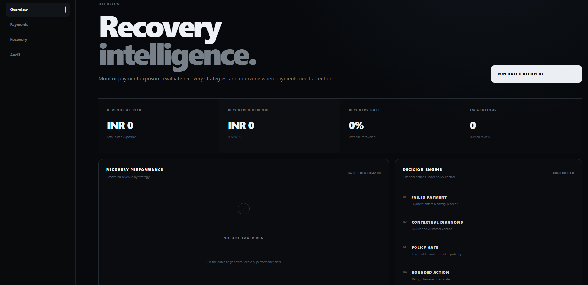
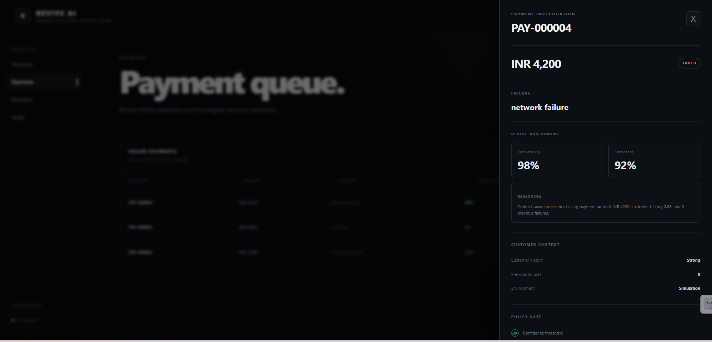
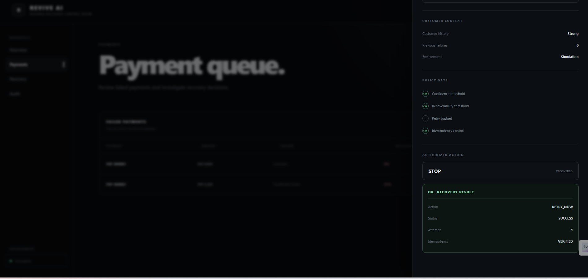
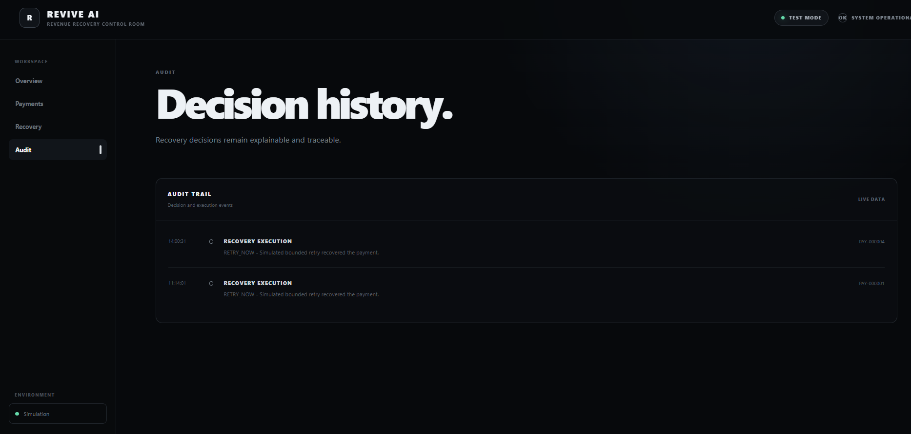

# REVIVE AI

## AI-Powered Revenue Recovery Controller

**Diagnose. Authorize. Recover. Audit.**

REVIVE AI is an AI-powered payment recovery controller for failed payments. It combines contextual diagnosis with deterministic financial safety controls to decide **what should happen next**, rather than blindly retrying every failure.

The core principle is simple:

> **AI reasons. Policy authorizes.**

---

## Why REVIVE?

Payment failures are not interchangeable.

A transient issuer or network failure may be worth retrying. An insufficient-funds failure may require customer intervention. An uncertain failure may need escalation. A payment that has already been recovered must not be retried again.

REVIVE turns those different situations into explicit, explainable recovery decisions.

```text
FAILED PAYMENT
      |
      v
CONTEXT-AWARE DIAGNOSIS
      |
      v
RECOVERABILITY + CONFIDENCE
      |
      v
DETERMINISTIC POLICY GATE
      |
      v
AUTHORIZED ACTION
      |
      v
BOUNDED EXECUTION
      |
      v
PAYMENT STATE + AUDIT TRAIL
```

---

## Recovery Decision Model

| Payment condition | Diagnosis | Authorized action |
|---|---|---|
| Transient issuer or network failure | Potentially recoverable | `RETRY_NOW` |
| Insufficient funds | Customer-dependent | `CUSTOMER_INTERVENTION` |
| Unknown or uncertain failure | Low confidence | `ESCALATE` |
| Already recovered | No further recovery required | `STOP` |

REVIVE deliberately separates **recommendation** from **authorization**.

An AI-generated recommendation does not automatically become a financial action.

---

## AI Judgment + Deterministic Safety

REVIVE uses AI-style contextual reasoning where judgment is useful, and deterministic logic where financial controls must be predictable and auditable.

### Diagnosis layer

Evaluates:

- Failure class
- Payment amount
- Customer history
- Previous failures
- Recoverability
- Confidence
- Recommended action

### Policy layer

Controls:

- Confidence thresholds
- Recoverability thresholds
- Retry limits
- Payment state
- Idempotency
- Action authorization
- Stopping conditions

### Executor

Executes only the action authorized by policy and records the resulting state transition.

```text
AI RECOMMENDS
      |
      v
POLICY CHECKS
      |
      +---- BLOCK / MODIFY ----> STOP / ESCALATE
      |
      v
AUTHORIZED ACTION
      |
      v
EXECUTOR
```

---

## Safety Example: STOP After Recovery

One of the key safety cases is an already recovered payment.

A diagnosis can still recognize the original transient failure and recommend `RETRY_NOW`. The policy layer sees that the payment has already been recovered and changes the authorized action to `STOP`.

```text
Original state:
FAILED

Diagnosis:
RETRY_NOW

Recovery:
SUCCESS

New state:
RECOVERED

Next authorized action:
STOP
```

This prevents repeated financial action after successful recovery.

---

## Benchmark

REVIVE includes a deterministic simulation engine so the recovery strategy can be evaluated on the **same generated batch** across multiple strategies.

### 1,000-payment benchmark

| Strategy | Recovered revenue | Recovery rate | Net recovered revenue |
|---|---:|---:|---:|
| Blind Retry | INR 15,54,366 | 29.02% | INR 15,52,366 |
| Static Rules | INR 15,20,085 | 28.38% | INR 15,19,333 |
| **REVIVE AI** | **INR 20,23,384** | **37.78%** | **INR 20,18,750** |

### REVIVE AI batch behavior

- **1,000** payments evaluated
- **181** retries
- **534** customer interventions
- **285** escalations

The benchmark is deterministic and uses a fixed seed:

```text
count = 1000
seed  = 42
```

Repeated runs with the same parameters produced identical results.

### Interpretation

In the controlled simulation:

- REVIVE recovers more simulated revenue than Blind Retry and Static Rules.
- REVIVE performs substantially fewer retries than Blind Retry.
- Non-retryable situations can be routed to intervention or escalation instead of repeated payment attempts.

> **Benchmark results are generated from controlled synthetic scenarios. They are not claims about production Razorpay performance.**

---

## Product Walkthrough

### 1. Overview



The control room presents revenue at risk, recovered revenue, recovery rate, strategy comparison, and payments requiring attention.

### 2. Payment Investigation



Each failed payment can be inspected before execution. The investigation view exposes the failure classification, recoverability, confidence, customer context, policy checks, and authorized action.

### 3. Recovery Result



After a successful bounded retry, the payment transitions from `FAILED` to `RECOVERED`. The policy then authorizes `STOP`, preventing another recovery action.

The execution result also records:

- Action
- Status
- Attempt number
- Idempotency state

### 4. Audit Trail



Recovery activity is recorded with payment ID, event, decision, reason, and timestamp.

---

## Architecture

```text
                         REVIVE AI
                            |
                 +----------+----------+
                 |                     |
                 v                     v
          Payment Service        Simulation Engine
                 |                     |
                 v                     v
             Diagnosis            Benchmark
                 |
                 v
           Policy Engine
                 |
                 v
        Bounded Recovery Executor
                 |
          +------+-------+
          |              |
          v              v
    Payment State     Audit Trail
          |
          v
        SQLite

External Provider Boundary
          |
          v
   Razorpay Provider
      Adapter Layer
```

### Component responsibilities

**Payment Service**  
Accepts payment-failure events and exposes database-backed payment records.

**Diagnosis Engine**  
Classifies the failure and evaluates payment/customer context to produce recoverability, confidence, and a recommended action.

**Policy Engine**  
Acts as the financial control boundary and decides what the system is actually allowed to do.

**Bounded Executor**  
Executes only an authorized action, updates payment state, and records the outcome.

**Audit API**  
Persists analysis and execution events for traceability.

**Simulation Engine**  
Generates deterministic synthetic payment batches and evaluates recovery strategies.

**Razorpay Adapter**  
Provides an isolated external-provider boundary so provider-specific API behavior does not leak into the core recovery domain.

---

## Tech Stack

| Layer | Technology |
|---|---|
| Frontend | React + Vite |
| Backend | Python + FastAPI |
| Database | SQLite + SQLAlchemy |
| Decisioning | Context-aware diagnosis + deterministic policy engine |
| Simulation | Reproducible benchmark engine |
| Integration | Razorpay provider adapter |

---

## API

### Health

```text
GET /api/v1/health
```

### Payments

```text
POST /api/v1/payments/events
GET  /api/v1/payments
GET  /api/v1/payments/{payment_id}
```

### Recovery

```text
POST /api/v1/recovery/analyze/{payment_id}
POST /api/v1/recovery/execute/{payment_id}
```

### Audit

```text
GET /api/v1/audit
```

### Analytics

```text
GET /api/v1/analytics/benchmark
GET /api/v1/analytics/summary
```

### Simulation

```text
POST /api/v1/simulation/run
```

Interactive API documentation is available at:

`http://127.0.0.1:8000/docs`

when the backend is running.

---

## Project Structure

```text
revive-ai/
|
+-- backend/
|   +-- app/
|   |   +-- ai/
|   |   +-- api/
|   |   +-- core/
|   |   +-- database/
|   |   +-- integrations/
|   |   +-- models/
|   |   +-- policy/
|   |   +-- schemas/
|   |   +-- services/
|   |   +-- main.py
|   |
|   +-- simulation/
|   +-- tests/
|
+-- frontend/
|   +-- src/
|
+-- data/
|   +-- sample_payments.json
|
+-- docs/
|   +-- architecture.md
|   +-- engineering-notes.md
|   +-- screenshots/
|       +-- overview.png
|       +-- payment-investigation.png
|       +-- recovery-result.png
|       +-- audit.png
|
+-- README.md
+-- .gitignore
```

---

## Run Locally

### Backend

```powershell
cd backend
.env\Scripts\Activate.ps1
python -m uvicorn app.main:app --reload
```

Backend:

`http://127.0.0.1:8000`

Swagger/OpenAPI:

`http://127.0.0.1:8000/docs`

### Frontend

```powershell
cd frontend
npm install
npm run dev
```

Frontend:

`http://localhost:5173`

---

## Demo

1. Start the backend.
2. Start the frontend.
3. Open `http://localhost:5173`.
4. Open **Overview** and run the batch recovery view.
5. Open **Payments** and inspect a failed payment.
6. Review the diagnosis, confidence, recoverability, customer context, and policy gate.
7. Execute a permitted `RETRY_NOW` action.
8. Verify the recovery result reports `SUCCESS`.
9. Verify the payment state changes to `RECOVERED`.
10. Verify the next authorized action is `STOP`.
11. Open **Audit** and inspect the persisted recovery event.

Useful demo cases:

```text
Network failure
→ RETRY_NOW

Insufficient funds
→ CUSTOMER_INTERVENTION

Unknown failure
→ ESCALATE

Already recovered
→ STOP
```

---

## Testing

The repository includes focused tests for diagnosis, policy authorization, and recovery behavior.

Run:

```powershell
cd backend
python -m unittest discover -s tests -v
```

The current test suite covers:

- Network failure retry recommendation
- Insufficient-funds intervention
- Unknown-failure escalation
- Already-recovered stop behavior
- Retry-budget enforcement
- Recoverable transient failures
- Non-recoverable unknown failures

---

## Engineering Notes

### Frontend state synchronization

During development, a successful recovery correctly changed the backend payment state to `RECOVERED`, but the selected payment in the frontend investigation drawer initially continued to display the previous `FAILED` state.

The cause was that the selected React payment state was not synchronized immediately with the execution response.

The fix updates the selected payment after successful execution and reloads the database-backed queue.

Result:

```text
FAILED
   |
   v
RETRY_NOW
   |
   v
SUCCESS
   |
   v
RECOVERED
   |
   v
STOP
```

### Razorpay access limitation

Live Razorpay API execution was not validated during development because merchant API credentials were unavailable.

Rather than claiming an untested live integration, REVIVE keeps the provider boundary isolated behind a Razorpay adapter while the complete recovery workflow operates through controlled simulation.

### Benchmark reproducibility

The benchmark uses a fixed seed and the same generated payment batch for all strategies. Running the benchmark twice with:

```text
count = 1000
seed = 42
```

produced identical results.

---

## Known Limitations

- Benchmark results are based on controlled synthetic payment scenarios.
- Live Razorpay API execution was not validated.
- The prototype uses SQLite rather than a production database.
- Recovery outcomes are simulated rather than connected to a production payment processor.
- The current policy model is deterministic and intentionally scoped for the prototype.

---

## Razorpay Integration

REVIVE includes an isolated Razorpay provider adapter.

The adapter supports the external-provider boundary for:

```text
GET payment
POST capture
```

The core recovery engine remains provider-independent.

Because merchant API credentials were not available during development, the submitted prototype does **not** claim successful live/Test Mode Razorpay execution.

---

## Current Status

```text
Payment ingestion             DONE
Context-aware diagnosis      DONE
Deterministic policy gate    DONE
Bounded recovery executor    DONE
Payment state transitions    DONE
Idempotency controls         DONE
Audit trail                  DONE
Benchmark simulation         DONE
Interactive control room    DONE
Automated tests              DONE
Sample data                  DONE
Architecture documentation  DONE
Engineering notes           DONE
Razorpay adapter boundary   DONE
Live Razorpay execution     NOT VALIDATED
```

---

## Future Scope

- Razorpay webhook ingestion
- Production payment-provider execution
- Merchant-specific recovery policies
- Historical recovery calibration
- Multi-provider payment orchestration
- Production-grade event processing and observability

---

## Disclaimer

REVIVE AI is a hackathon prototype and simulation environment.

Benchmark results are generated from controlled synthetic scenarios and should not be interpreted as production payment performance or live Razorpay results.

---

## Final Principle

> **REVIVE turns payment recovery from blind retries into controlled decision-making.**
